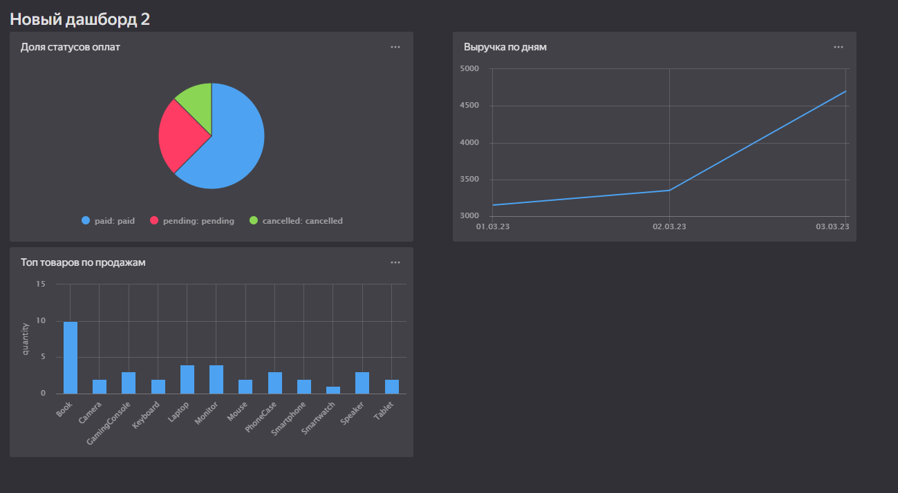

# Обработка и анализ данных в Yandex Cloud: от загрузки до визуализации

## Задание 1: Работа с Yandex Data Proc и Hive/Spark

### 1. Поднятие кластера Yandex Data Proc
Создан кластер Yandex Data Proc с компонентами:
- Hadoop (HDFS)
- Hive
- Spark

### 2. Создание таблиц
#### Таблица `transactions_v2`
```sql
CREATE TABLE transactions_v2 (
    transaction_id BIGINT,
    user_id BIGINT,
    amount DECIMAL(10,2),
    currency STRING,
    transaction_date TIMESTAMP,
    is_fraud INT
)
ROW FORMAT DELIMITED
FIELDS TERMINATED BY ','
STORED AS TEXTFILE;

INSERT INTO transactions VALUES
(10001,500,250.0,'USD','2023-03-10 14:25:00',0),
(10002,500,300.5,'EUR','2023-03-10 14:30:00',1),
(10003,501,-10.0,'USD','2023-03-10 15:00:00',0),
(10004,502,400.0,'???','2023-03-10 15:10:00',0),
(10005,501,120.5,'RUB','2023-03-11 09:00:00',1),
(10006,503,999.0,'USD','2023-03-11 09:05:00',0),
(10007,504,0.0,'USD','2023-03-11 10:10:00',1),
(10008,504,750.0,'EUR','2023-03-11 10:20:00',1),
(10009,500,275.25,'RUB','2023-03-12 11:00:00',0),
(10010,500,600.0,'USD','2023-03-12 11:05:00',1),
(10011,505,45.5,'GBP','2023-03-12 11:10:00',0),
(10012,505,-25.0,'USD','2023-03-12 11:15:00',1),
(10013,506,9999.99,'USD','2023-03-13 09:00:00',1),
(10014,506,120.5,'EUR','2023-03-13 09:05:00',0),
(10015,507,500.0,'GBP','2023-03-13 09:10:00',1),
(10016,507,123.45,'???','2023-03-13 09:15:00',0),
(10017,508,0.0,'RUB','2023-03-14 10:00:00',1),
(10018,508,450.0,'USD','2023-03-14 10:05:00',0),
(10019,509,1000.0,'EUR','2023-03-14 10:10:00',0),
(10020,509,-75.5,'RUB','2023-03-14 10:20:00',1);
```

#### Таблица `logs_v2`
```python
CREATE TABLE logs (
    log_id BIGINT,
    transaction_id BIGINT,
    category STRING,
    comment STRING,
    log_timestamp TIMESTAMP
)
ROW FORMAT DELIMITED
FIELDS TERMINATED BY ','
STORED AS TEXTFILE;

INSERT INTO logs VALUES
(1, 10001, 'Electronics', 'User bought a phone', '2023-03-10 14:26:00'),
(2, 10002, 'Travel', 'Flight ticket to Europe', '2023-03-10 14:31:00'),
(3, 99999, 'System', 'Unrelated transaction', '2023-03-10 14:40:00'),
(4, 10004, 'System', 'Weird currency ???', '2023-03-10 15:15:00'),
(5, 10006, 'Electronics', 'Laptop purchase', '2023-03-11 09:10:00'),
(6, 10007, 'Misc', 'Zero amount transaction?', '2023-03-11 10:11:00'),
(7, 10010, 'Electronics', 'Gaming console', '2023-03-12 11:06:00'),
(8, 10012, 'System', 'Negative sum, check fraud', '2023-03-12 11:16:00'),
(9, 10013, 'Other', 'Big sum transaction', '2023-03-13 09:10:00'),
(10, 10015, 'Travel', 'Train ticket in RUB', '2023-03-14 08:50:00'),
(11, 10001, 'Electronics', 'Repeat mention phone?', '2023-03-10 14:27:00'),
(12, 11111, 'System', 'No valid transaction link', '2023-03-14 08:55:00');
```

### 3. Примеры агрегаций
#### Фильтрация по валютам и суммарные суммы
```sql
SELECT 
    currency,
    COUNT(*) AS transaction_count,
    SUM(amount) AS total_amount,
    AVG(amount) AS avg_amount
FROM 
    transactions
WHERE 
    currency IN ('USD', 'EUR', 'RUB')
GROUP BY 
    currency
ORDER BY 
    total_amount DESC;
```

#### Ежедневная статистика транзакций
```sql
SELECT 
    DATE(transaction_date) AS day,
    COUNT(*) AS transaction_count,
    SUM(amount) AS daily_volume,
    AVG(amount) AS avg_transaction,
    SUM(CASE WHEN is_fraud = 1 THEN 1 ELSE 0 END) AS fraud_count
FROM 
    transactions
GROUP BY 
    DATE(transaction_date)
ORDER BY 
    day;
```

---

## Задание 2: Работа с ClickHouse

### 1. Создание таблиц
```sql
CREATE TABLE orders (
    order_id UInt64,
    user_id UInt64,
    order_date DateTime,
    total_amount Decimal(10,2),
    payment_status String
) ENGINE = MergeTree()
ORDER BY order_id;
```

```sql
CREATE TABLE order_items (
    item_id UInt64,
    order_id UInt64,
    product_name String,
    product_price Decimal(10,2),
    quantity UInt32
) ENGINE = MergeTree()
ORDER BY (order_id, item_id);
```

### 2. Загрузка данных
```sql
INSERT INTO orders FROM INFILE 'orders.csv' FORMAT CSVWithNames;
```

### 3. Примеры агрегаций
#### Статистика по статусам оплат
```sql
SELECT 
    payment_status,
    COUNT(*) as order_count,
    SUM(total_amount) as total_sum,
    AVG(total_amount) as avg_order
FROM 
    db1.orders
GROUP BY 
    payment_status;
```

#### Топ-5 пользователей по сумме заказов
```sql
SELECT 
    user_id,
    SUM(total_amount) as total_spent,
    COUNT(*) as order_count
FROM 
    db1.orders
WHERE 
    payment_status = 'paid'
GROUP BY 
    user_id
ORDER BY 
    total_spent DESC
LIMIT 5;
```

#### Соединение с `order_items`
```sql
SELECT 
    o.order_id,
    o.user_id,
    o.total_amount,
    COUNT(i.item_id) as items_count,
    SUM(i.product_price * i.quantity) as calculated_total
FROM 
    db1.orders o
JOIN 
    db1.order_items i ON o.order_id = i.order_id
GROUP BY 
    o.order_id, o.user_id, o.total_amount
ORDER BY 
    o.order_id;
```

---

## Задание 3: Визуализация в DataLens

### Дашборд: «Анализ транзакций и заказов»


